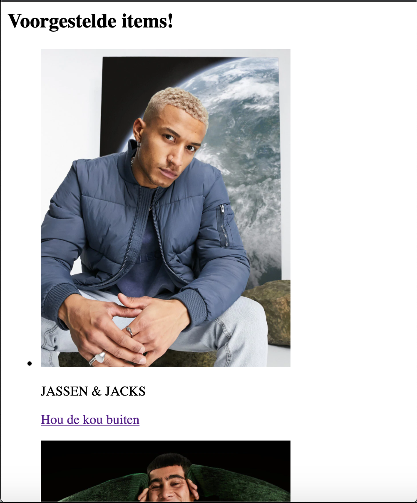
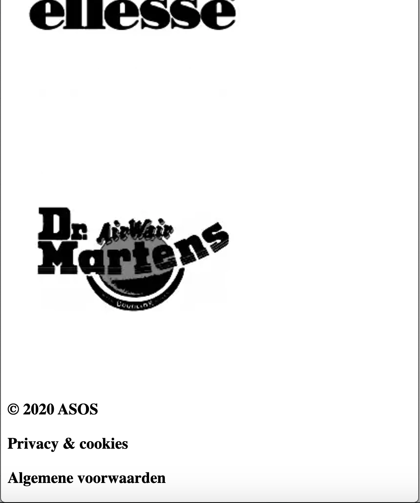
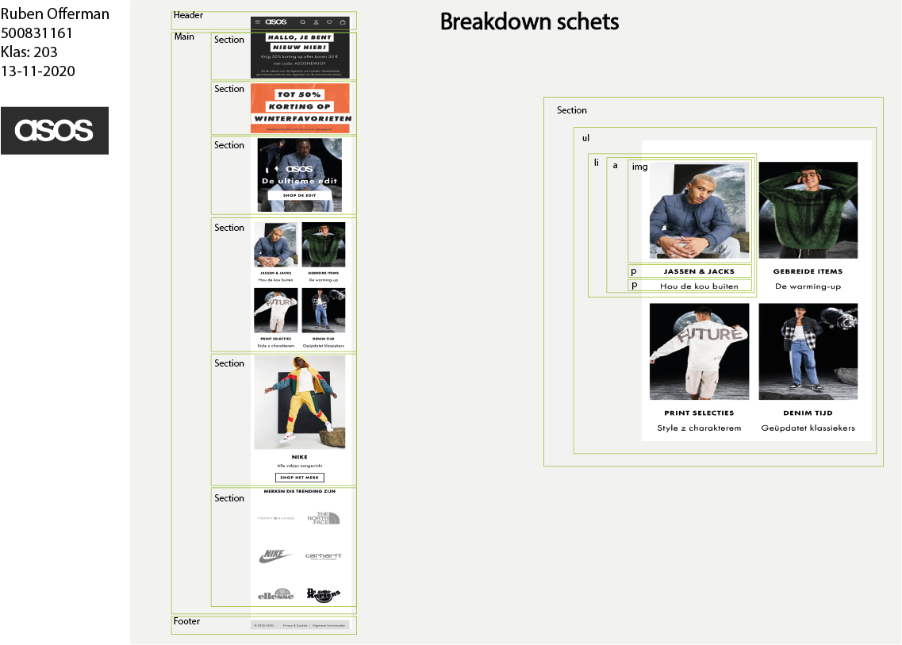
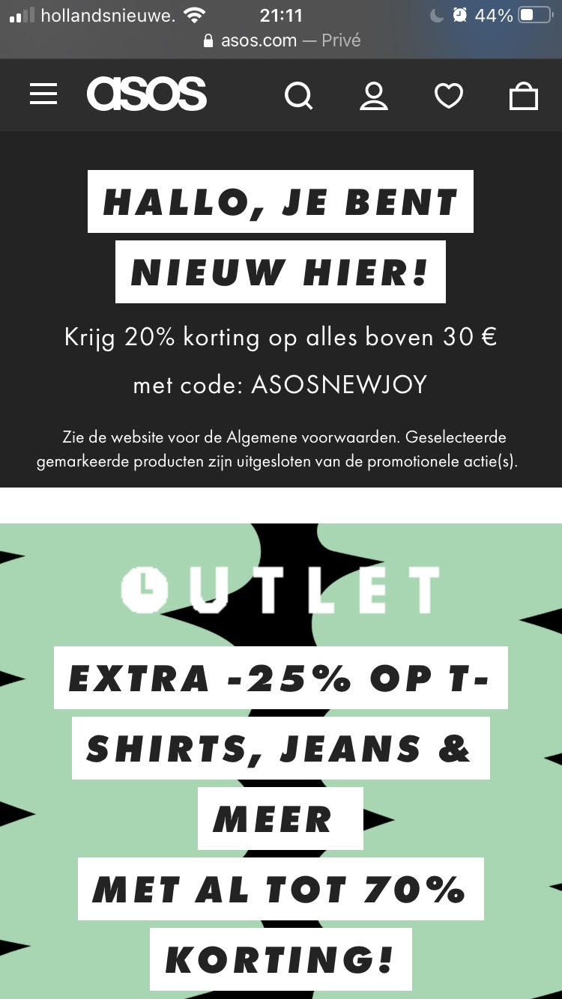
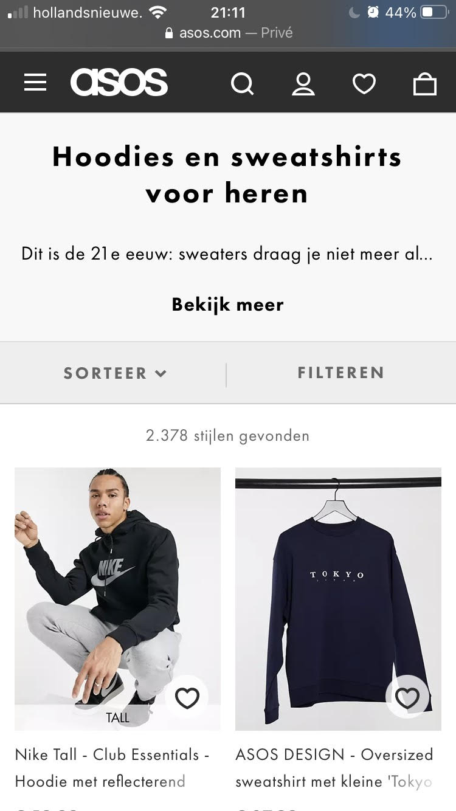

# Procesverslag
**Auteur:** Ruben Offerman

Markdown cheat cheet: [Hulp bij het schrijven van Markdown](https://github.com/adam-p/markdown-here/wiki/Markdown-Cheatsheet). Nb. de standaardstructuur en de spartaanse opmaak zijn helemaal prima. Het gaat om de inhoud van je procesverslag. Besteedt de tijd voor pracht en praal aan je website.

## Bronnenlijst
1. -bron 1-
2. -bron 2-
3. -...-

## Eindgesprek (week 7/8)

-dit ging goed & dit was lastig-

**Screenshot(s):**

-screenshot(s) van je eindresultaat-

## Voortgang 3 (week 6)

-same as voortgang 1-

## Voortgang 2 (week 5)

- Voor mij was de afgelopen week erg zwaar, met school en prive. Hierdoor heb ik helaas nog niet veel sprongen kunnen maken met mijn webpagina.
- Hetgene wat mij wel is gelukt heeft voor mijn gevoel wel goed gewerkt en ben ik toch een beetje verder gekomen. Mede dankzij de hulp van de student assistent en mede studenten <3

**Screenshot(s):**

-

### Agenda voor meeting

-samen met je groepje opstellen-

| Ruben     | Marijn         | Kathleen   | Jordi       |
| ---            | ---                | ---          | ---              |
|Hoe positioneer ik de SVGs in mijn header | Uitlijnen van elementen, positioneren.        | Hoe breng ik SVGs op maat?  | Het bespreken van een slider.   |

### Verslag van meeting

-

## Voortgang 1 (week 3)

### Stand van zaken

- Ik heb wel moeite met het goed aan de opdracht werken. Ik ben zelf namelijk niet goed in het coderen en vind het dan ook lastig om door te gaan als het niet lukt
- Wel is wat ik heb gedaan goed gelukt en heeft de uitleg van anderen zeker bijgedragen.

**Screenshot(s):**

Helaas heb ik nog weinig echte voortgang kunnen maken. Im vind dit zelf ook erg zonde en ga na het voortgangsgesprek ook zeker de achterstand inhalen die ik heb gemaakt.

### Agenda voor meeting

-samen met je groepje opstellen-

| Ruben     | Marijn         | Kathleen   | Jordi       |
| ---            | ---                | ---          | ---              |
|Hoe zorg ik ervoor dat het responsive is en niet weg van elkaar glijdt. | uitlijningen en afbeeldingen         | Het uitlijnen van foto's  | Het bespreken van een slider.   |

### Verslag van meeting

- Gebruik maken van SVG's als iconen erg handige tip!
- alvast voor zorgen dat de fotos mee scalen als je de pagina uitzoomd geeft een goede look aan de webpagina
- Gebruik maken van grids! is niet moeilijk maar kan wel een verschil maken in de layout van je pagina

## Breakdownschets (week 1)

-uitwerken voor de 1e werkgroep - eind van de eerste week-

## Intake (week 1)
-uitwerken voor de kick-off werkgroep - begin van de eerste week-

**Je startniveau:** Mijn niveau voor nu is BLAUW

**Je focus:** Ik ga voor nu mijn focus leggen op de responsiveness leggen voor mijn website.

**Je opdracht:** https://www.asos.com/nl/heren/

**Screenshot(s) van de eerste pagina (small screen):**

**Screenshot(s) van de tweede pagina (small screen):**

